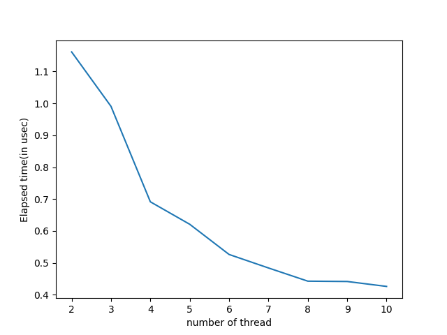
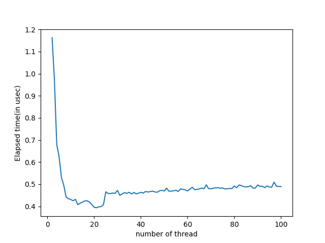
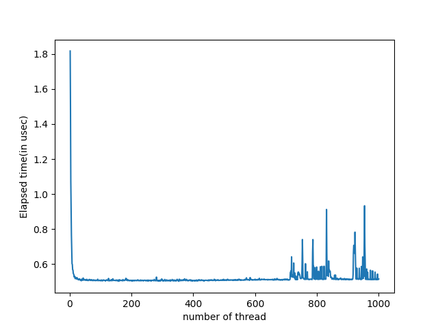

# О работе 
В данной работе проводиться измерения времени работы программы при расчете определенного интеграла методом Монте-Карло в несколько потоков. Измерим зависимость времени исполнения программы от количества потоков.
Опытным путем найдем количество ядер на компьютере. Программа будет запускаться на macbook Air 2020 m1.

# Сборка
Для проведения эксперимента надо запустить скрипт `make_experiment.sh` из папки проекта

# Результаты 
Измерения для 10 потоков

По данному графику можно заключить, что чип m1, использовавшийся в работе имеет 8 ядер.

