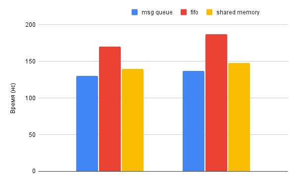

# Тестирование скоростей IPC примитивов
Данная лаборанторная работа тестирует скорость передачи файлов с помощью таких IPC примитивов, как FIFO, shared memory, message queue
## Результаты
Измерения проводились на малом буфере 150 байт, среднем - 4 кБ, большом 4 Гб.

На среднем и малом:

На большом буфере:

.png)
